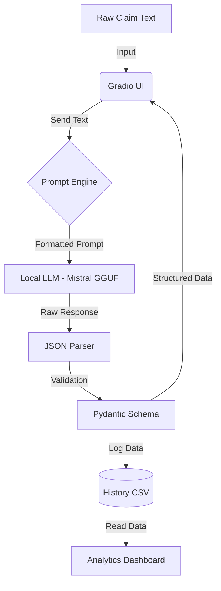

# 📝 Claims Description Normalizer 

**Automating Insurance Claim Understanding with Local LLMs (Mistral 7B + llama.cpp)**

> **Project Status:** 🟢 Ready for Demo  
> **Context:** Developed as a case study demo for **ValueMomentum**.

## 📖 Overview

This project demonstrates the development of an **offline, privacy-first AI system** capable of converting messy, unstructured insurance claim notes into clean, validated JSON data.

By utilizing **quantized LLMs (GGUF)** running locally via `llama.cpp`, this solution ensures that sensitive insurance data (PII) never leaves the secure environment, addressing a critical data privacy concern in the insurance industry.

**Key Capabilities demonstrated:**
* Natural Language Processing (NLP) & Entity Extraction
* Prompt Engineering & Schema Design
* Offline Inference (No API costs, Air-gapped compatible)
* Full-stack GenAI application (Backend + UI + Analytics)

---

## 🚀 Features

### 1. 🔒 Offline & Private (Mistral 7B GGUF)
* Powered by `llama-cpp-python` to run on consumer hardware (CPU/GPU).
* **No Internet Required:** Fully functional in air-gapped enterprise environments.
* **Zero Data Leakage:** Eliminates the risk of sending sensitive claim data to public cloud APIs.

### 2. ⚡ Intelligent Claim Normalization
The model analyzes free-text descriptions and extracts specific structured fields:
* **`loss_type`** (e.g., Fire, Water, Theft)
* **`severity`** (Low / Medium / High / Critical)
* **`asset`** (The item affected)
* **`estimated_loss`** (Monetary value)
* **`incident_date`** (ISO Format)
* **`location`** (City, State)
* **`confidence`** (Model's self-assessed confidence)
* **`explanation`** (Why the model extracted these values)

### 3. 🖥️ Interactive Gradio UI
The application features a modern web interface with two distinct modules:
* **🔍 Normalize Claim:** Input raw text, view the JSON output, and read a generated summary.
* **📊 History & Analytics:** Automatically logs processed claims to a CSV and visualizes trends (Severity Distribution, Loss Types) using Pandas and Plotly.

---

## 🏗️ System Architecture



**Tech Stack:**
* **Language:** Python 3.10+
* **Inference:** `llama-cpp-python`
* **Model:** Mistral-7B-Instruct-v0.2 (Quantized GGUF)
* **UI:** Gradio
* **Data Handling:** Pandas, Pydantic

---

## 📦 Project Structure

```bash
claims-description-normalizer/
│
├── data/                  # Stores the generated history.csv log
├── models/                # Place your .gguf model file here
│
├── llm_engine.py          # Handles GGUF model loading & inference configuration
├── normalizer.py          # Core logic: Prompt engineering & JSON extraction
├── schema.py              # Pydantic models for data validation
├── ui_app.py              # Main entry point: Gradio UI & Analytics
│
├── requirements.txt       # Python dependencies
└── README.md              # Documentation
```

---

## 🧩 Setup & Installation

Follow these steps to set up the project locally.

### 1. Clone the Repository
```bash
git clone https://github.com/your-username/claims-description-normalizer.git
cd claims-description-normalizer
```

### 2. Create Virtual Environment
It is recommended to use a virtual environment to manage dependencies.

**For Windows:**
```bash
python -m venv venv
venv\Scripts\activate
```

**For Mac/Linux:**
```bash
python3 -m venv venv
source venv/bin/activate
```

### 3. Install Dependencies
```bash
pip install --upgrade pip
pip install -r requirements.txt
```
> **Note:** If you have an NVIDIA GPU, make sure to install the `llama-cpp-python` version compatible with CUDA for faster inference.

### 4. Download the Model
This project uses the **Mistral 7B** model in GGUF format. 
1. Download the model file (approx 4GB): [mistral-7b-instruct-v0.2.Q4_K_M.gguf](https://huggingface.co/TheBloke/Mistral-7B-Instruct-v0.2-GGUF)
2. Move the downloaded file into the `models/` folder inside the project directory.

Your path should look like this: `claims-description-normalizer/models/mistral-7b-instruct-v0.2.Q4_K_M.gguf`

### 5. Run the Application
```bash
python ui_app.py
```
Once the server starts, open your browser and navigate to:
👉 **[http://127.0.0.1:7860](http://127.0.0.1:7860)**

---

## 💡 Future Enhancements

- [ ] **REST API:** Wrap the engine in FastAPI for integration with external claim systems.
- [ ] **RAG Integration:** Allow the model to look up specific policy documents during extraction.
- [ ] **Fine-Tuning:** Train a LoRA adapter specifically on insurance datasets for higher accuracy.
- [ ] **Multi-modal:** Support image inputs (photos of damage) alongside text.

---

## 👨‍💻 Author

**Paneri Fulbandhe** *B.Tech CSE*

This project was conceptually designed and developed to demonstrate engineering capabilities.
